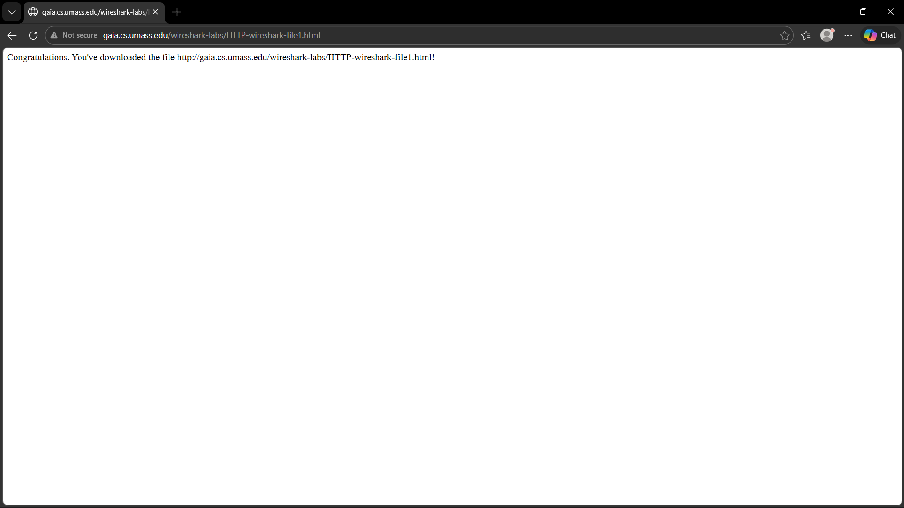
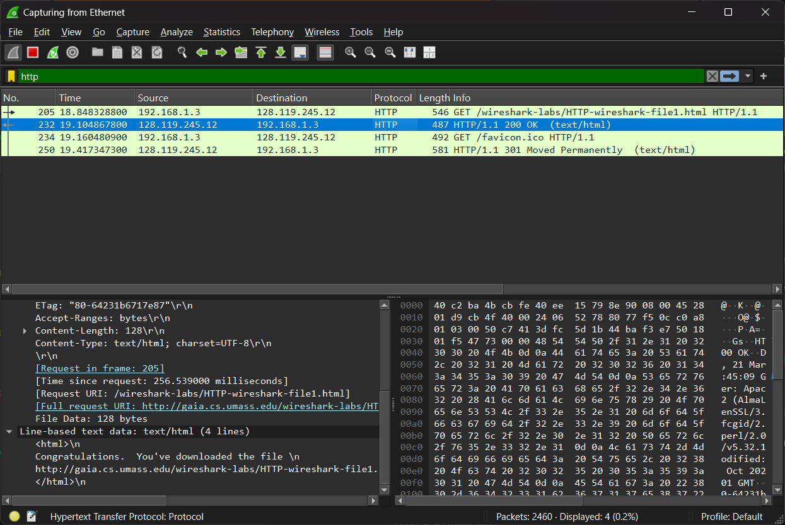
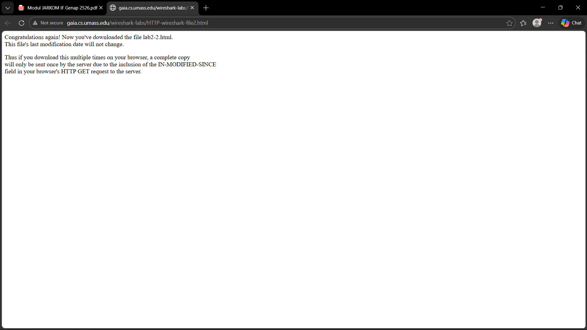
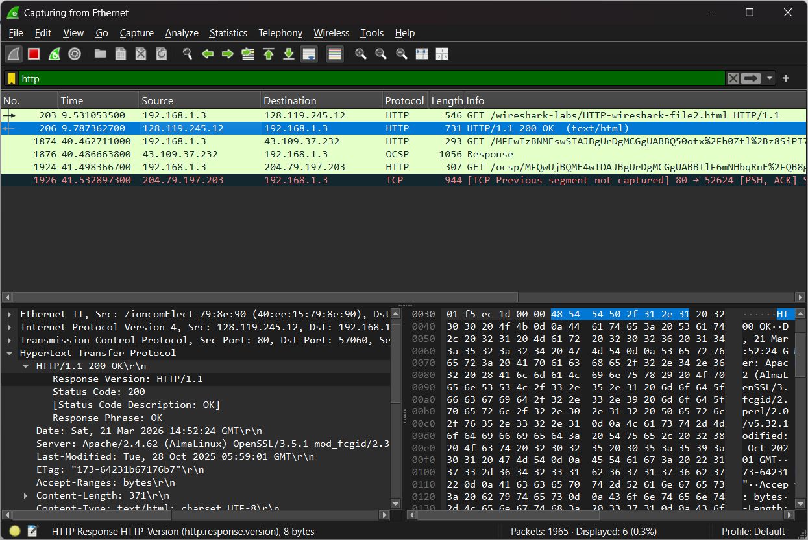
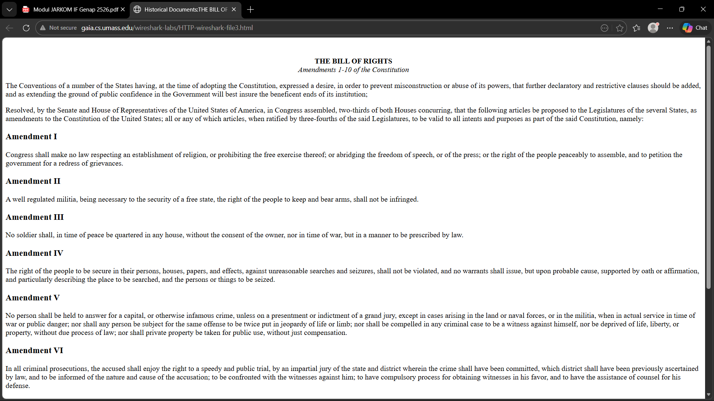
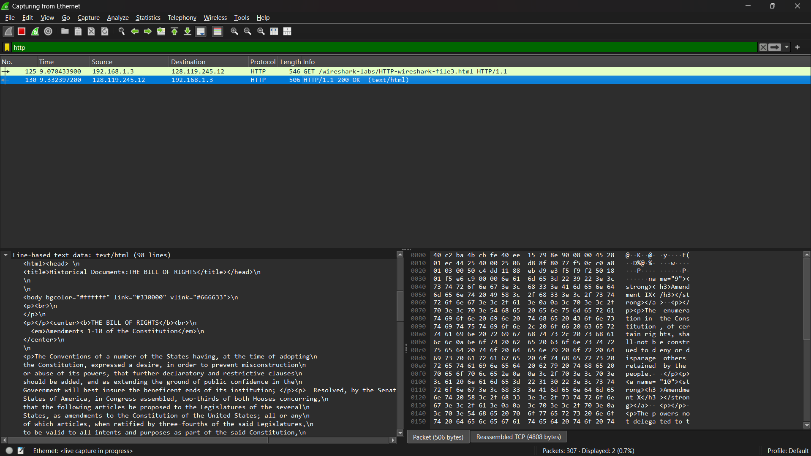
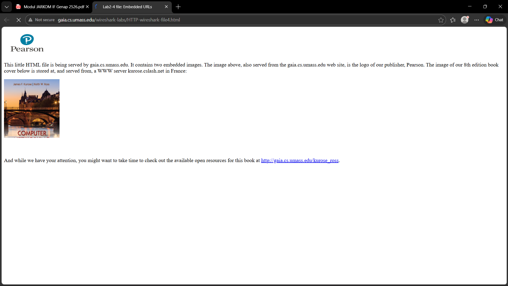
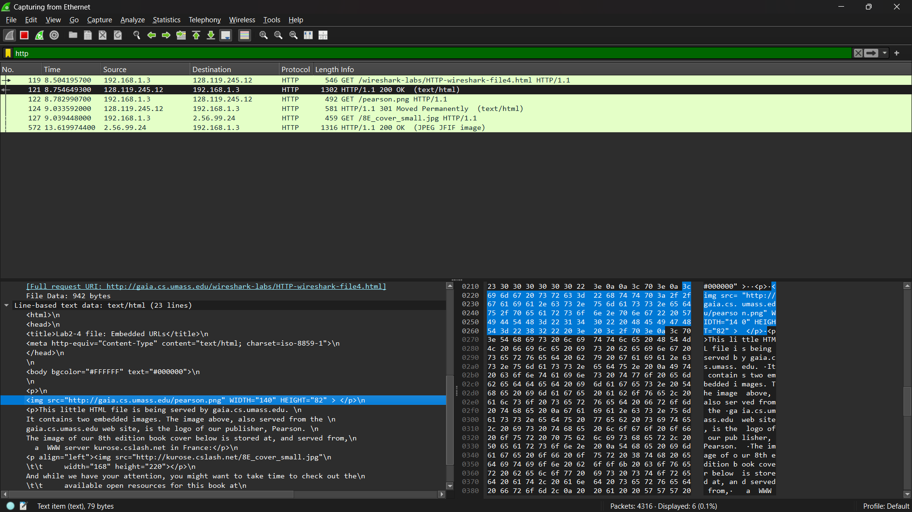
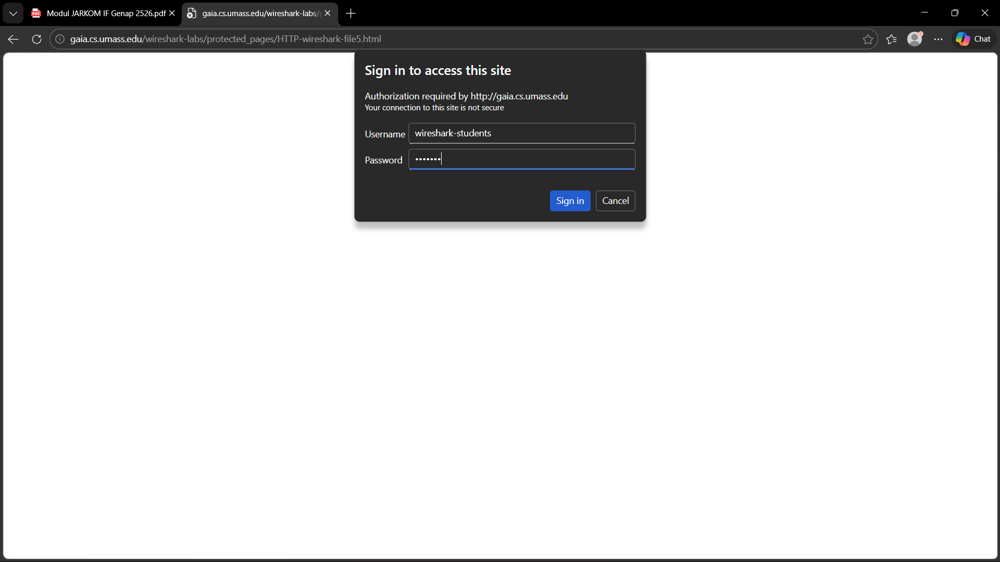
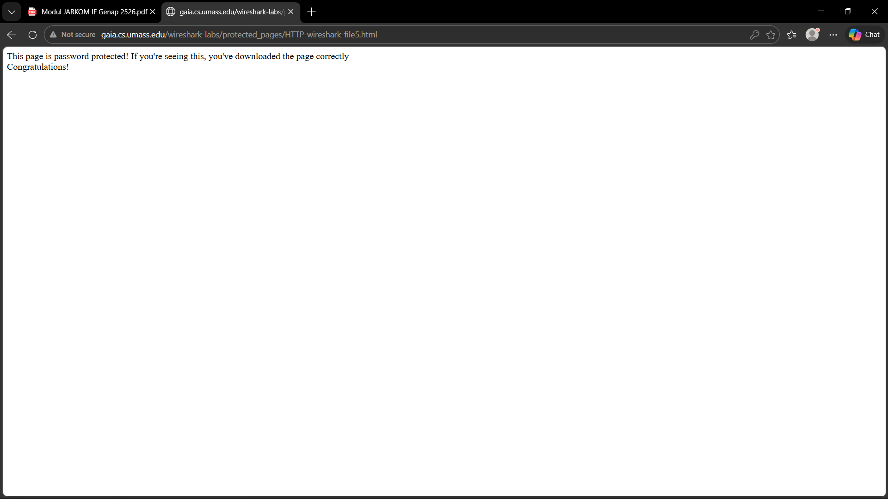

# Week 3
## HTTP
### Penjelasan
1. Basic HTTP GET/Response Interaction

Pada percobaan ini dilakukan pengambilan file HTML sederhana tanpa objek tambahan.

Langkah - langkah :
- Jalankan browser
- Mulai capture menggunakan Wireshark, lalu ketik http pada filter.
- Masukan link berikut di web : http://gaia.cs.umass.edu/wireshark-labs/HTTP-wireshark-file1.html
- Hentikan capture

Hasil tangkapan Wireshark menunjukkan bahwa:

- Browser mengirimkan HTTP GET request ke server.
- Server memberikan HTTP response dengan status 200 OK.

Hal ini menunjukkan mekanisme dasar HTTP, yaitu:

- Client mengirim permintaan (request)
- Server memberikan balasan (response)

Karena file yang diminta berukuran kecil, maka respon server dikirim dalam satu paket tanpa fragmentasi.

---

2. HTTP CONDITIONAL GET/response interaction

Pada percobaan ini dilakukan akses halaman yang sama sebanyak dua kali untuk melihat mekanisme caching.

Langkah - langkah :
- Jalankan browser
- Mulai capture menggunakan Wireshark, lalu ketik http pada filter.
- Masukan link berikut di web : http://gaia.cs.umass.edu/wireshark-labs/HTTP-wireshark-file2.html
- Hentikan capture

Hasil yang diamati:

- Request kedua mengandung header If-Modified-Since
- Server dapat merespon dengan:
- - 304 Not Modified jika file tidak berubah
- - 200 OK jika file telah diperbarui

Mekanisme ini digunakan untuk:

- Mengurangi penggunaan bandwidth
- Mempercepat waktu akses dengan memanfaatkan cache di sisi client

---

3. Retrieving Long Documents

Langkah - langkah :
- Jalankan browser
- Mulai capture menggunakan Wireshark, lalu ketik http pada filter.
- Masukan link berikut di web : http://gaia.cs.umass.edu/wireshark-labs/HTTP-wireshark-file3.html
- Hentikan capture

Pada percobaan pengambilan file berukuran besar, ditemukan bahwa:

- Response HTTP tidak dikirim dalam satu paket
- Data dipecah menjadi beberapa segmen TCP

Di Wireshark ditandai dengan:

- “TCP segment of a reassembled PDU”

Hal ini menunjukkan bahwa:

- HTTP berjalan di atas TCP
- TCP akan membagi data besar menjadi beberapa segmen agar dapat dikirim melalui jaringan

---

4. HTML Documents dengan Embedded Objects

Pada percobaan berikutnya, halaman web yang diakses mengandung objek tambahan seperti gambar.

Langkah - langkah :
- Jalankan browser
- Mulai capture menggunakan Wireshark, lalu ketik http pada filter.
- Masukan link berikut di web : http://gaia.cs.umass.edu/wireshark-labs/HTTP-wireshark-file4.html
- Hentikan capture

Hasil pengamatan menunjukkan:

- Terdapat lebih dari satu HTTP GET request.
- Selain mengambil file HTML utama, browser juga mengirim request tambahan untuk setiap objek (misalnya gambar).

Hal ini terjadi karena:

- File HTML hanya berisi referensi (link) ke objek lain
- Browser harus mengambil setiap objek secara terpisah

Oleh karena itu, satu halaman web dapat menghasilkan banyak request HTTP.

---

5. HTTP Authentication

Pada percobaan terakhir dilakukan akses ke halaman yang dilindungi dengan username dan password.

Hasil pengamatan:

- Data username dan password dikodekan menggunakan Base64

Namun, encoding Base64:

- Bukan enkripsi
- Dapat dengan mudah didekode kembali ke bentuk asli

Sehingga dapat disimpulkan bahwa, HTTP tanpa enkripsi tambahan (HTTPS) tidak aman untuk pertukaran data sensitif

---

## Kesimpulan
Pada praktikum kali ini, dapat disimpulkan bahwa protokol HTTP bekerja dengan mekanisme komunikasi request dan response antara client dan server. Melalui Wireshark, terlihat bahwa setiap akses halaman web diawali dengan pengiriman HTTP GET oleh client dan direspon oleh server dengan status tertentu seperti 200 OK. Selain itu, satu halaman web tidak selalu hanya terdiri dari satu request, melainkan dapat menghasilkan banyak request tambahan apabila terdapat objek seperti gambar atau file lain yang terpisah dari HTML utama.

Selain itu, HTTP juga memiliki mekanisme tambahan seperti caching melalui Conditional GET untuk meningkatkan efisiensi, serta kemampuan menangani pengiriman data besar dengan membagi data menjadi beberapa segmen TCP. Pada sisi keamanan, penggunaan HTTP Authentication dengan encoding Base64 menunjukkan bahwa data sensitif belum sepenuhnya aman tanpa penggunaan protokol tambahan seperti HTTPS.