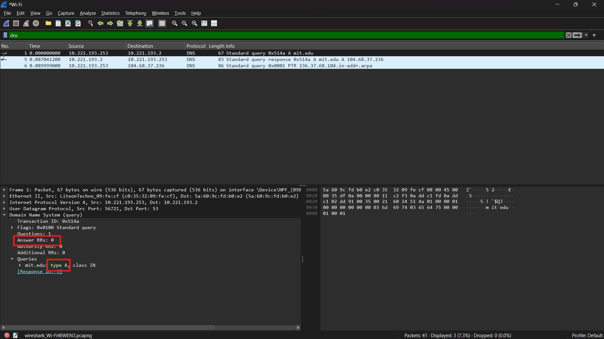

#### Nama : Delon Nicholas Hermawan
#### NIM : 103072400156
#### Kelas : IF-04-04
# Pertanyaan
## Perintah nslookup –type=NS mit.edu
1. Ke alamat IP manakah pesan permintaan DNS dikirimkan? Apakah alamat IP tersebut 
merupakan default alamat IP server DNS lokal Anda? 
2. Periksa pesan permintaan DNS. Apa ”jenis” atau ”type” dari pesan tersebut? Apakah pesan 
tersebut mengandung ”jawaban” atau ”answers”? 
3. Periksa pesan balasan DNS. Apa nama server MIT yang diberikan oleh pesan balasan? 
Apakah pesan balasan ini juga memberikan alamat IP untuk server MIT tersebut?
# Jawaban :
1.

---

2.

Jenis atau type dari pesan tersebut adalah A. Pesan tersebut tidak mengandung jawaban atau answers.

---

3.

Pesan balasan ini juga memberikan alamat IP untuk server MIT